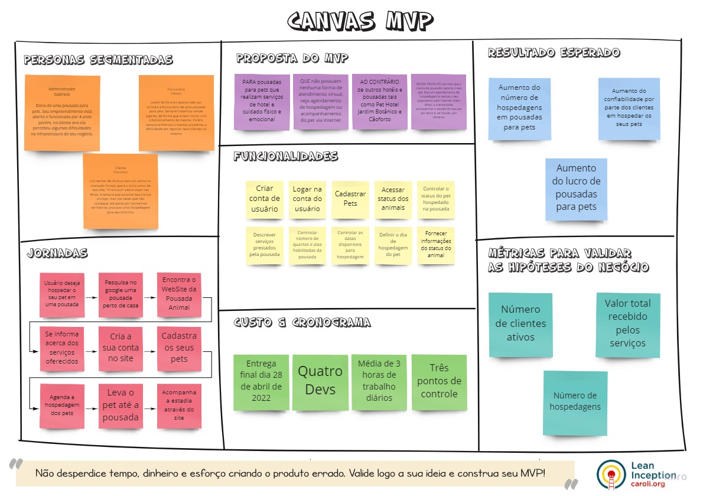

# Canvas MVP

## Histórico de revisão

| Data       | Autor                                        | Modificações                      | Versão |
| ---------- | -------------------------------------------- | --------------------------------- | ------ |
| 22/02/2022 | [Luís Lins](https://github.com/luisgaboardi) | Cria documento, introdução e referências | 1.0 |
| 22/02/2022 | [Luís Lins](https://github.com/luisgaboardi) | Adiciona imagem e link do Canvas MVP | 1.1 |

## Introdução

O Canvas MVP é um template de _startup lean_ para a validação de ideias de produtos. É uma representação visual com elementos descrevendo a proposta de um Mínimo Produto Viável (MVP), a saber: personas, jornadas, proposta, funcionalidades, custo e cronograma, resultado esperado e métricas para validar as hipóteses do négocio. Esse template auxilia para o alinhamento da ideia do produto entre todos os envolvidos no desenvolvimento e o dono do produto.

## Canvas MVP

[Link para o Miro](https://miro.com/app/board/uXjVOU3NO04=/?invite_link_id=342459343443)

## Referências Bibliográficas
1. The MVP Canvas. **Paulo Caroli**. 2015. Disponível em: https://www.caroli.org/en/the-mvp-canvas/. Acesso dia 22 de Fev de 2022.
