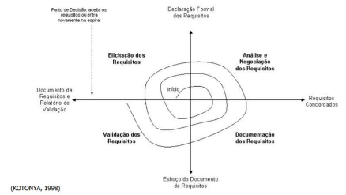

# ABORDAGEM DE ENGENHARIA DE REQUISITOS

## Histórico de revisão
| Data       | Autor                                        | Modificações                      | Versão |
| ---------- | -------------------------------------------- | --------------------------------- | ------ |
| 02/02/2021 | [Luís Lins](https://github.com/luisgaboardi) | Adiciona primeira versão da engenharia de requisitos | 1.0    |

A equipe decidiu em uma **abordagem em espiral**, ou seja, interativa e incremental, no qual primeiro iremos fazer a elicitação de requisitos, a análise dos requisitos, documentação de requisitos e verificações e validações dos mesmos. Terminando as atividades do processo de engenharia de requisitos, a equipe tem a cada início de sprint a liberdade de corrigir um requisito ou incrementar mais de acordo com as necessidades do projeto.

## Elicitação de Requisitos

O levantamento dos requisitos será feito pelo método BrainStorm, onde todos discutem quais serão os requisitos necessários para o sistema. Também teremos a histórias e usuário e o levantamento dos requisitos não funcionais que serão elucidados em workshops online.

| Atividade | Método | Ferramenta
| --------- | ------ | -------
| Levantamento de requisitos funcionais | BrainStorm | Microsoft Teams
| Criação das histórias de usuário | Reuniões estruturadas | Microsoft Teams
| Levantamento de requisitos não funcionais | Reuniões estruturadas | Microsoft Teams

## Análise de Requisitos
A análise de requisitos será feita através do Workshop de requisitos, onde o grupo irá se reunir e discutir sobre aspectos importantes do sistema como, o escopo, o risco e características. Esse método foi escolhido por acelerar o processo de elicitação e promover a participação de todos, normalmente ele dura de 3 a 5 dias porém, por sermos um grupo pequeno acreditamos que iremos realizar esse processo na metade do tempo, de 2 a 3 dias.

| Atividade | Método | Ferramenta
| --------- | ------ | -------
| Refinamento e reconsideração dos requisitos levantados | Reuniões estruturadas | Microsoft Teams e Google Sheet
| Definição das tarefas em cima de cada requisito | Reuniões estruturadas | Microsoft Teams e Google Sheet

## Documentação de Requisitos
A documentação seguirá o critério adotado pelos fornecedores do sistema, o método XP, da escrita em dupla.

| Atividade | Método | Ferramenta
| --------- | ------ | -------
| Documentar os requisitos aprovados | Escrita pareada | Microsoft Teams e Google Sheet
| Documentar a alteração ou remoção de requisitos | Escrita pareada | Microsoft Teams e Google Sheet

## Verificação e Validação de Requisitos
A verificação, isto é, a revisão do documento, terá como método a inspeção. Será feita pela dupla que não participou da elaboração do documento.
A validação será feita através dos clientes aparentes, o dono de uma pousada para pets e o utilizador, que deixa o seu pet sob cuidados da pousada. A aprovação dos requisitos poderá ser feita de forma presencial ou online a depender da localização.
Atividade
Método
Ferramenta
Verificação
Inspeção
Microsoft Teams e Google Docs
Validação
Questionário com terceiros
Por questionários

## Gerenciamento de Requisitos 
O uso das Baseline de requisitos tornará possível diferenciar o que era o requisito original, o que foi colocado e descartado. Assim, possibilitará melhor entendimento das alterações feitas.

Atividade
Método
Ferramenta
Atualizar o status dos requisitos
Reuniões estruturadas
Microsoft Teams e Google Sheet
Garantir que a documentação está em dia com a mudança dos requisitos
Reuniões estruturadas
Microsoft Teams e Google Sheet
Avaliar impactos das mudanças de requisitos
Uso de baseline
Microsoft Teams e Google Sheet

## REFERÊNCIAS BIBLIOGRÁFICAS
1. https://www.scrum.org/
1. https://www.agilealliance.org/agile101/agile-glossary/
1. http://www.extremeprogramming.org/rules.html
1. Sommerville, Ian Engenharia de software/ Ian Sommerville; tradução Luiz Cláudio Queiroz; revisão técnica Fábio Levy Siqueira. -- 10. ed. -- São Paulo: Pearson Education do Brasil, 2018. Título original: Software engineering ISBN 978-65-5011-048-2 1. Engenharia de software I. Siqueira.
1. Material de aula do professor George Marsicano, FGA/UnB