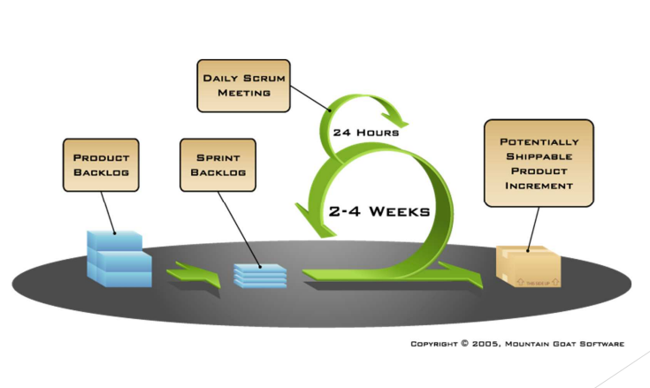
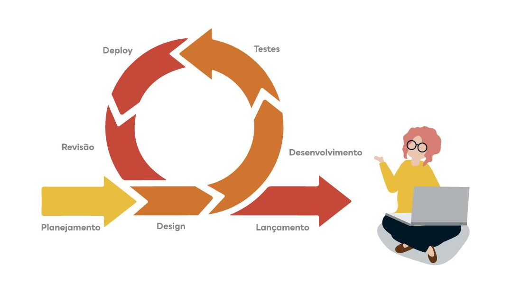

# ABORDAGEM DE DESENVOLVIMENTO DE SOFTWARE

## Histórico de revisão

| Data       | Autor                                        | Modificações                      | Versão |
| ---------- | -------------------------------------------- | --------------------------------- | ------ |
| 02/02/2022 | [Luís Lins](https://github.com/luisgaboardi) | Adiciona primeira versão da metodologia da equipe | 1.0    |
| 14/02/2022 | [Kathlyn Lara](https://github.com/klmurussi) | Correção do endereço das imagens | 2.0 |
| 17/02/2021 | [Luís Lins](https://github.com/luisgaboardi) | Uso de imagens em português e remove comentários do professor | 2.1 |
| 17/02/2022 | [Kathlyn Lara](https://github.com/klmurussi) | Padrão CamelCase | 2.2 |
| 18/02/2022 | [Kathlyn Lara](https://github.com/klmurussi) | Padrão ABNT nas referências | 2.3 |

## Metodologia
Em relação às **questões técnicas**, o sistema a ser desenvolvido é pequeno, envolvendo poucas funcionalidades e as que existem não são complexas. Funcionará como um sistema de registro e controle de clientes, ademais como um website de divulgação, que estará sujeito a controle externo por parte dos contratantes e tem vida útil prevista de menos de 1 mês, já que não há cliente e nem interesse em manter a manutenção do produto.

No que diz respeito ao **time de desenvolvimento**, são quatro estudantes de graduação que não possuem conhecimento profundo de infraestrutura,  requisitos e testes, mas todos atuarão em todas as disciplinas de engenharia de software do projeto. Por fim, como principal ferramenta contribuinte para o desenvolvimento do projeto, destacamos o Github, onde faremos o controle de versionamento e o trabalho comunitário do produto.

Se tratando das **questões organizacionais**, não existe a necessidade de extrema especificação prévia de projeto, design ou requisitos, já que é um projeto acadêmico e os próprios desenvolvedores são os clientes. Dessa forma, é possível ter feedback constante um dos outros, o que possibilita as entregas incrementais de acordo com o nível de agrado da equipe. Como se trata de um sistema para uma pousada fictícia, não existem questões legais que possam impedir o desenvolvimento do projeto.

Diante das reflexões acima, a equipe decidiu utilizar uma **abordagem metodológica mista**, utilizando alguns recursos de Scrum, Extreme Programming, desenvolvimento ágil e KanBan.

### Scrum

  

Imagem de [Witix](https://www.witix.com.br/blog-postagens/9/metodologia-scrum-tudo-o-que-voce-precisa-para-nao-atrasar-seus-projetos)

Do Scrum, realizaremos as Dailys, as Sprints, a elaboração do Product Backlog, assim como a cada Sprint, uma Sprint Review e uma Sprint Planning para verificar o andamento do projeto e definir as prioridades da equipe. Essas escolhas se basearam em uma experiência prévia da equipe, que valoriza o encontro diário, o desenvolvimento baseado em Sprints e o fato de que apesar de termos um planejamento geral, podermos definir quais atividades serão desenvolvidas na Sprint. Além disso, não usaremos os papéis do Scrum ao pé da letra, principalmente pelo fato de sermos somente 4 pessoas. A proposta é que ao trabalharmos em duplas (como será explicado no ponto de Extreme Programming), que uma dupla seja o Proprietário do Produto da outra dupla, avaliando se o resultado daquela Sprint está condizente com os requisitos levantados. Seremos todos membros da Equipe de Desenvolvimento e alternaremos a cada Sprint quem será o Mestre do Scrum.

### Desenvolvimento Ágil

  

Do Desenvolvimento Ágil, utilizaremos o conceito de MVP (Mínimo Produto Viável) e as Histórias de Usuário, para auxiliar na definição dos requisitos do produto. Não só por conta das exigências da disciplina, mas a equipe acredita que o foco em desenvolver um MVP garante um melhor andamento para o projeto e que o uso de Histórias de Usuário nos ajuda a não desenvolver funcionalidades que não são necessárias. Dessa forma, os dois conceitos se complementam. Além disso, faremos uso de um quadro Kanban para controlar o que ainda precisa ser feito, o que ainda precisa ser revisado, o que está em desenvolvimento na Sprint atual e, por fim, o que já foi concluído. Acreditamos que a visualização e acompanhamento do quadro por conta da equipe nos dará mais informações acerca do andamento do projeto, de forma que a equipe poderá analisar de forma mais clara se o ritmo de trabalho atual satisfará as exigências da disciplina.

### Extreme Programming
Do Extreme Programming, a equipe realizará a abordagem de programação em pares, já que a nossa equipe possui 4 pessoas. Acreditamos que isso vai promover maior produtividade e facilidade de acompanhamento.

## Referências Bibliográficas
1. ABC EDUCATION SERVICES. **Scrum.org**, 2022. Treinamento para a prática de scrum. Disponível em https://www.scrum.org/. Acesso em 17 fev. 2022.
2. AGILE Glossary. **Agile Alliance**, 2022. Disponível em https://www.agilealliance.org/agile101/agile-glossary/. Acessado em 18 fev. 2022.
3. DON WELLS. **Extreme Programming.org**, 1999. Valores do extreme programming. Disponível em http://www.extremeprogramming.org/rules.html. Acesso em 18 fev. 2022.
4. SOMMERVILLE, Ian. **Engenharia de software**. 10 ed. Tradução Luiz Cláudio Queiroz; revisão técnica Fábio Levy Siqueira. São Paulo: Pearson Education do Brasil, 2018.
5. MARSICANO, George. Requisitos de Software: Fundamentos de Engenharia de Software (Revisão). Brasília. 2020. Apresentação em PowerPoint. 77 slides, color, Material de aula do curso de Engenharia de Software da FGA/UNB. Disponível em: https://aprender3.unb.br/pluginfile.php/1624496/mod_resource/content/3/REQ_Aula%201%20-%20Fundamentos%20da%20ESW-atualizado.pdf. Acesso em: 18 fev 2022.
