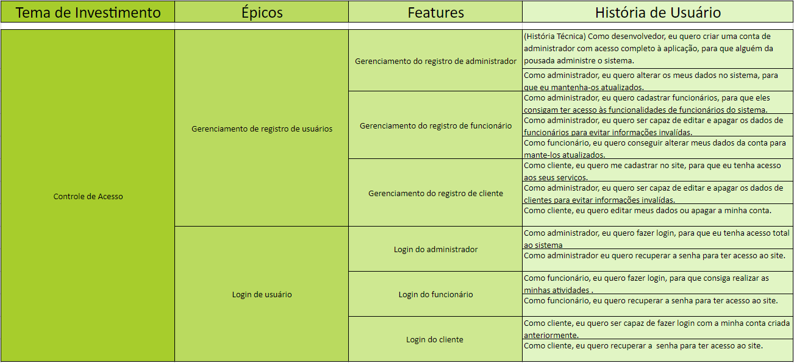
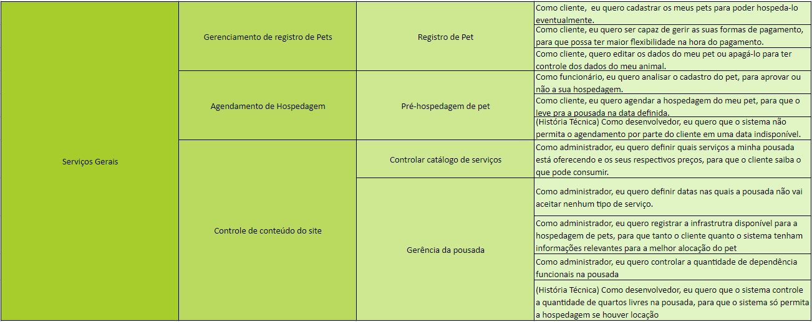
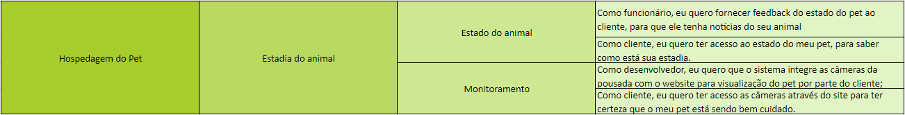

# Backlog do Produto

## Histórico de revisão
| Data       | Autor                                        | Modificações                      | Versão |
| ---------- | -------------------------------------------- | --------------------------------- | ------ |
| 12/02/2022 | [Luís Lins](https://github.com/luisgaboardi), [Lais Portela](https://github.com/laispa), [Ana Julia](https://github.com/aluzianobriceno), [Lara Murussi](https://github.com/klmurussi) | Adiciona primeira versão do Backlog do Produto | 1.0 |
| 15/02/2022 | [Ana Júlia](https://github.com/aluzianobriceno) | Atualização dos títulos no sumário | 1.1 | 
| 18/02/2022 | [Kathlyn Lara](https://github.com/klmurussi) | Adicionando regras da ABNT nas referências bibliográficas | 1.2 |
| 23/02/2022 | [Luís Lins](https://github.com/luisgaboardi) | Organização geral do documento e imagens do backlog | 1.3 |

## Introdução
O Backlog do Produto faz parte da metodologia Scrum, onde é colocado todas os requisitos necessarios para o desenvolvimento do projeto. Para a organização do backlog foi utilizado a estrutura de organização de requisitos do SAFe, que é divida em quatro partes: Temas de investimento, épicos, features e histórias de usuário.

### *Temas de investimento*
Representam o valor chave que o nosso produto irá prover ao mercado, quais são os principais problemas que o nosso produto resolve?

### *Épicos*
É composto por uma coleção de features. É uma iniciativa em larga escala que gera a entrega de serviços e soluções para o cliente.

### *Features*
Serviços promovidos pelo sistema para cumprir com as necessidades do usuário. É desenvolvida por um conjunto de histórias de usuário.

### *Histórias de usuário* 
É uma breve descrição de uma funcionalidade que foi discutida. Segue o seguinte formato:

``` Como [persona], eu [quero], [para que]  ```

## Backlog do Produto





# Referências Bibliográficas
1. MARSICANO, George. Requisitos de Software: Identificando Histórias de Usuário. Brasília. 2021. Apresentação em PowerPoint. 64 slides, color, Material de aula do curso de Engenharia de Software da FGA/UNB. Disponível em: https://aprender3.unb.br/pluginfile.php/1624530/mod_resource/content/0/REQ_Aula%20-%20Identificando%20Hist%C3%B3rias%20de%20Usuarios.pdf. Acesso em: 18 fev 2022.
2. REHKOPF, Max. Histórias de usuários com exemplos e um template. **Atlassian Agile Coach**. Disponível em: https://www.atlassian.com/br/agile/project-management/user-stories. Acesso em 12 fev 2022.