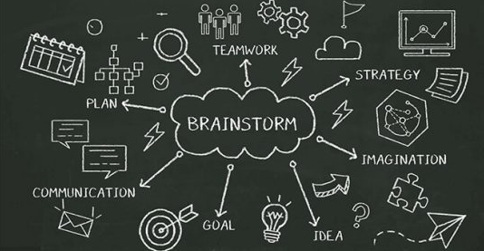

# ABORDAGEM DE ENGENHARIA DE REQUISITOS

## Histórico de revisão
| Data       | Autor                                        | Modificações                      | Versão |
| ---------- | -------------------------------------------- | --------------------------------- | ------ |
| 02/02/2022 | [Luís Lins](https://github.com/luisgaboardi) | Adiciona primeira versão da engenharia de requisitos | 1.0  |
| 08/02/2022 | [Laís Portela](https://github.com/laispa)|Correção da abordagem de requisitos e ajuste|1.1           |
| 11/02/2022 | [Ana Júlia](https://github.com/aluzianobriceno) | Ajustando o metódo de desenvolvimento com a engenharia de requisitos | 1.2 |
| 12/02/2022 | [Luís Lins](https://github.com/luisgaboardi) | Remove comentários desnecessários | 1.3 |
| 12/02/2022 | [Luís Lins](https://github.com/luisgaboardi) | Muda ferramentas | 1.4 |
| 14/02/2022 | [Kathlyn Lara](https://github.com/klmurussi) | Mudar o endereço da imagem | 1.5 |
| 17/02/2022 | [Kathlyn Lara](https://github.com/klmurussi) | Adicionando padrão CamelCase nas referências bibliográficas | 1.6 |
| 18/02/2022 | [Kathlyn Lara](https://github.com/klmurussi) | Adicionando padrão ABNT nas referências | 1.7 |

A equipe decidiu, a abordagem da engenharia de Requisitos no contexto ágil, pois o método escolhido para o desenvolvimento de software tem técnicas que tratam da E.R. No seu contexto ágil o principal responsável é o Product Owner. No nosso time, ao longo do semestre, todos farão o papel de um P.O. Além disso, a metodogia ágil conta com a criação do product backlog, em que será listado todos os requisitos. Como o desenvolvimento é dividido em um ciclo de Sprints, os requisitos não terão necessidade de serem detalhados logo no início do projeto, e sim quando estiverem proxímos de seu desenvolvimento.

## Elicitação de Requisitos

  

O levantamento dos requisitos será feito pelo método BrainStorm, onde todos discutem quais serão os requisitos necessários para o sistema. Também teremos a histórias e usuário e o levantamento dos requisitos não funcionais que serão elucidados em workshops online.

| Atividade | Método | Ferramenta
| --------- | ------ | -------
| Levantamento de requisitos funcionais | BrainStorm | Microsoft Teams
| Criação das histórias de usuário | Reuniões estruturadas | Microsoft Teams
| Levantamento de requisitos não funcionais | Reuniões estruturadas | Microsoft Teams
| Identificação do Backlog do Produto | Reunião estruturada | Microsoft Teams

## Análise de Requisitos
A análise de requisitos será feita através do Workshop de requisitos, onde o grupo irá se reunir e discutir sobre aspectos importantes do sistema como, o escopo, o risco e características. Esse método foi escolhido por acelerar o processo de elicitação e promover a participação de todos, normalmente ele dura de 3 a 5 dias porém, por sermos um grupo pequeno acreditamos que iremos realizar esse processo na metade do tempo, de 2 a 3 dias.

| Atividade | Método | Ferramenta
| --------- | ------ | -------
| Refinamento e reconsideração dos requisitos levantados | Reuniões estruturadas | Microsoft Teams e Github Pages
| Definição das tarefas em cima de cada requisito | Reuniões estruturadas | Microsoft Teams e Github Pages

## Documentação de Requisitos
A documentação seguirá o critério adotado pelos fornecedores do sistema, o método XP, da escrita em dupla.

| Atividade | Método | Ferramenta
| --------- | ------ | -------
| Construção do Backlog do Produto | Escrita pareada | Microsoft Teams e Github Pages 

## Verificação e Validação de Requisitos
A verificação, isto é, a revisão do documento, terá como método a inspeção. Será feita pela dupla que não participou da elaboração do documento, sendo dividida nessas etapas:
- Planejamento: A dupla que fará a verificação será devidida em inspetor e moderador
- Detecção dos defeitos: O inspetor fará a busca dos possíveis defeitos.
- Dicriminação dos Defeitos: Todas as partes analisam, e dividem os defeitos em falso positivo e outros como positivos. Os falsos serão descartados e os outros serão agrupados em uma lista de defeitos.
- Retrabalho: A dupla autora do documento corrige os defeitos de acordo com a lista.
- Continuação: O moderador decide se uma nova inspeção ou não deve acontecer.

A validação será feita através dos clientes aparentes, o dono de uma pousada para pets e o utilizador, que deixa o seu pet sob cuidados da pousada. A aprovação dos requisitos poderá ser feita de forma presencial ou online a depender da localização.

| Atividade | Método | Ferramenta
| --------- | ------ | -------
| Verificação | Inspeção | Microsoft Teams
| Validação | Questionário com terceiros | Por questionários

## Gerenciamento de Requisitos 
O uso das Baseline de requisitos tornará possível diferenciar o que era o requisito original, o que foi colocado e descartado. Assim, possibilitará melhor entendimento das alterações feitas.

| Atividade | Método | Ferramenta
| --------- | ------ | -------
Atualizar o status dos requisitos | Reuniões estruturadas | Microsoft Teams e Github Pages
| Garantir que a documentação está em dia com a mudança dos requisitos | Reuniões estruturadas | Microsoft Teams e Github Pages
| Manter registro das mudanças de requisitos | Uso de baseline | Microsoft Teams e Github Pages

## Referências Bibliográficas
1. ABC EDUCATION SERVICES. **Scrum.org**, 2022. Treinamento para a prática de scrum. Disponível em https://www.scrum.org/. Acesso em 17 fev. 2022.
2. AGILE Glossary. **Agile Alliance**, 2022. Disponível em https://www.agilealliance.org/agile101/agile-glossary/. Acessado em 18 fev. 2022.
3. DON WELLS. **Extreme Programming.org**, 1999. Valores do extreme programming. Disponível em http://www.extremeprogramming.org/rules.html. Acesso em 18 fev. 2022.
4. SOMMERVILLE, Ian. **Engenharia de software**. 10 ed. Tradução Luiz Cláudio Queiroz; revisão técnica Fábio Levy Siqueira. São Paulo: Pearson Education do Brasil, 2018.
5. MARSICANO, George. Requisitos de Software: Atividades de ER - Parte II. Brasília. 2021. Apresentação em PowerPoint. 39 slides, color, Material de aula do curso de Engenharia de Software da FGA/UNB. Disponível em: https://aprender3.unb.br/pluginfile.php/1624524/mod_resource/content/0/REQ_Aula%203%20-%20Atividades%20da%20ER%20-%20parte%202.pdf. Acesso em: 18 fev 2022.
3. Marcos Kalinowski, Rodrigo Oliveira Spinola, Guilherme Horta Travassos
6. KALINOWSKI, Marcos; SPINOLA, Rodrigo O., TRAVASSOS, Guilherme H. **Infra-estrutura Computacional para Apoio ao Processo de Inspeção de Software**. Brasília. 2004. Disponível em: http://www-di.inf.puc-rio.br/~kalinowski//publications/KalinowskiST04.pdf. Acesso em: 2 de fev. de 2022.
