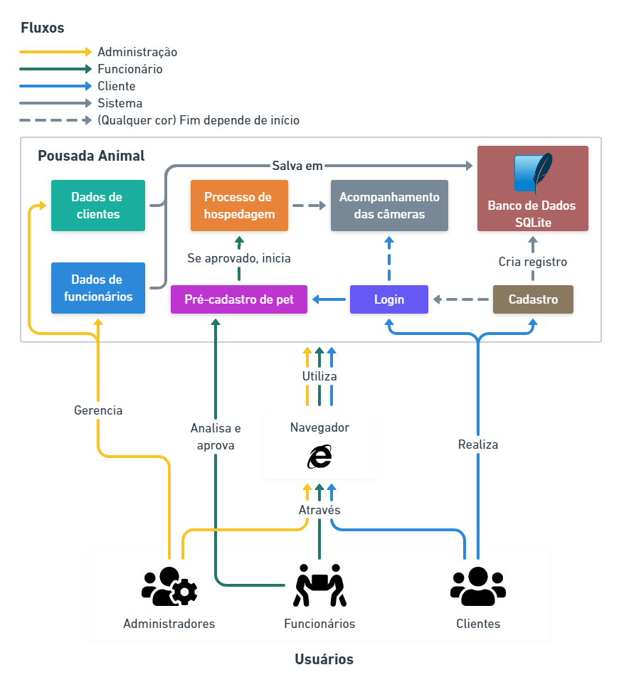

# Rich Picture

## Histórico de revisão

| Data       | Autor                                        | Modificações                      | Versão |
| ---------- | -------------------------------------------- | --------------------------------- | ------ |
| 08/02/2022 | [Luís Lins](https://github.com/luisgaboardi) | Adiciona primeira versão da Rich Picture | 1.0 |

## Introdução

Rich picture é uma ferramenta de modelagem para análise de problemas e apresentações de ideias. É um desenho que descreve o problema e o produto de maneira visual, expressando quem são as entidades do projeto e as relações que precisam ser levadas em conta no desenvolvimento do projeto. Consiste em fotos, textos, símbolos e ícones, os quais são utilizados para ilustrar graficamente a situação.

Essa forma de representação foi escolhida tendo em vista o estágio atual do desenvolvimento do projeto, aproveitando o alto nível de abstração e de liberdade interpretativa para a elaboração do rich picture.

## Rich Picture

