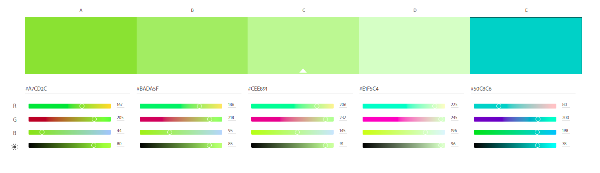

# Identidade Visual

## Histórico de revisão
| Data       | Autor                                        | Modificações                      | Versão |
| ---------- | -------------------------------------------- | --------------------------------- | ------ |
| 11/02/2022 | [Ana Júlia](https://github.com/aluzianobriceno) | Adição do documento de identidade visual inicial | 1.0  |
| 12/02/2022 | [Luís Lins](https://github.com/luisgaboardi) | Adição do documento de identidade visual inicial | 1.1  |
| 14/02/2022 | [Kathlyn Lara](https://github.com/klmurussi) | Mudança do endereço das imagens | 1.2 |

## Introdução

O documento de identidade visual tem como principal objetivo definir os parâmetros dos objetos de design das telas da aplicação, sendo eles:

- Paleta de cores: cores utilizadas na aplicação. Caracterizando o site;

- Logomarca: Logo do website;

- Tipografia: fonte utilizada.

## Paleta de cores

A paleta de cores escolhida é a seguinte:

## Tipografia

A fonte dos títulos do website será a *Georgia*.
Para textos normais, a tipografia escolhida foi a *Sans serif*, que é mais minimalista e sem prolongamentos, a fonte utilizada será *Source Sans Pro*.

## Logomarca

A logomarca escolhida é: 

Também foi feita uma logo minimalista para ficar como favicon do website:

