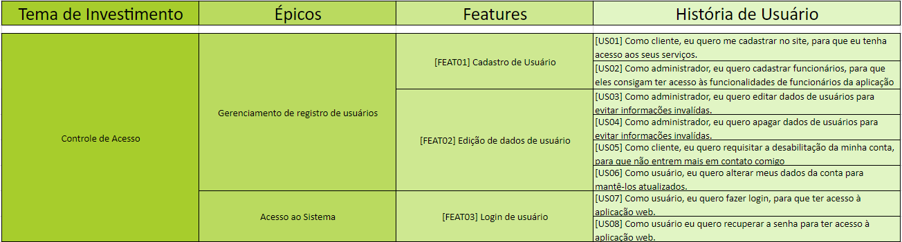
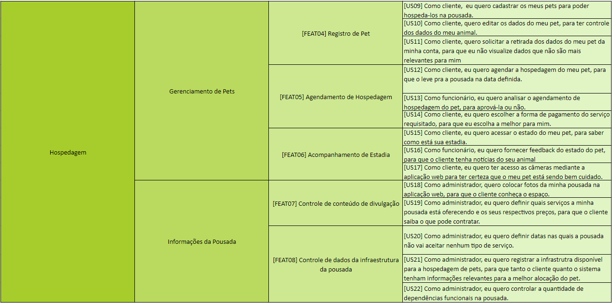

# Backlog do Produto

## Histórico de revisão
| Data       | Autor                                        | Modificações                      | Versão |
| ---------- | -------------------------------------------- | --------------------------------- | ------ |
| 18/02/2022 | [Luís Lins](https://github.com/luisgaboardi), [Ana Júlia](https://github.com/aluzianobriceno) | Adiciona novo Backlog do Produto | 1.0 |
| 22/02/2022 | [Ana Júlia](https://github.com/aluzianobriceno) | Adiciona Personas | 1.1 |

## Introdução
O Backlog do Produto faz parte da metodologia Scrum, onde é colocado todas os requisitos necessarios para o desenvolvimento do projeto. Para a organização do backlog foi utilizado a estrutura de organização de requisitos do SAFe, que é divida em quatro partes: Temas de investimento, épicos, features e histórias de usuário.

### *Temas de investimento*
Representam o valor chave que o nosso produto irá prover ao mercado, quais são os principais problemas que o nosso produto resolve?

### *Épicos*
É composto por uma coleção de features. É uma iniciativa em larga escala que gera a entrega de serviços e soluções para o cliente.

### *Features*
Serviços promovidos pelo sistema para cumprir com as necessidades do usuário. É desenvolvida por um conjunto de histórias de usuário.

### *Histórias de usuário* 
É uma breve descrição de uma funcionalidade que foi discutida. Segue o seguinte formato:

``` Como [persona], eu [quero], [para que]  ```

## Personas
É um personagem fictício que representa o cliente ideal de um negócio. Nesse projeto teremos 3 tipos de personas: o administrador, o funcionário e o cliente.

### Administrador
**Gabriela** tem 28 anos e é dona de uma pousada para pets. Seu empreendimento está aberto e funcionado por 4 anos porém, no último ano ela percebeu algumas dificuldades na infraestrutura de seu negócio. Seus clientes estavam diminuíndo por não conseguirem agendar a estadia de seus pets. Além disso, os funcionários da pousada estavam enfrentando problemas na hora de registrar os pets na pousada, o sistema interno da empresa não estava suprindo as necessidades da mesma. E a concorrência com outras pousadas estava muito acirrada.

### Funcionário
**Cleiton**, um jovem de 30 anos apaixonado por animais é funcionário de uma pousada para pets. Sempre trabalhou nesses lugares, de forma que é bem íntimo com o funcionamento da mesma. Porém, sempre enfrentou o mesmo problema, a dificuldade em registrar seus clientes no sistema. Apesar de sempre ter trabalhado com pets, nunca foi fácil para ele navegar pelo sistema interno das empresas em que ele trabalhou.

### Cliente
**Francisco**, um senhor de 45 anos tem um cachorro, chamado Coruja, que é o único amor de sua vida. *Francisco* adora viajar nas férias, e sempre que possível leva Coruja consigo, mas nas vezes que não consegue, ele passa por momentos terríveis ao procurar uma hospedagem para seu bichinho. *Francisco* é bastante antenado nas mídias sociais porém, seu conhecimento tecnologico acaba ai, quando uma pousada para pets aparece em seu feed, ele vai atrás, mas nunca acha informações suficientes ou quando acha não consegue entrar em contato e fazer o agendamento.

## Backlog do Produto




# Referências Bibliográficas
1. MARSICANO, George. Requisitos de Software: Identificando Histórias de Usuário. Brasília. 2021. Apresentação em PowerPoint. 64 slides, color, Material de aula do curso de Engenharia de Software da FGA/UNB. Disponível em: https://aprender3.unb.br/pluginfile.php/1624530/mod_resource/content/0/REQ_Aula%20-%20Identificando%20Hist%C3%B3rias%20de%20Usuarios.pdf. Acesso em: 18 fev 2022.
2. REHKOPF, Max. Histórias de usuários com exemplos e um template. **Atlassian Agile Coach**. Disponível em: https://www.atlassian.com/br/agile/project-management/user-stories. Acesso em 12 fev 2022.